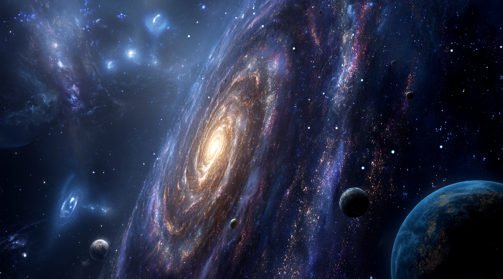

# Prologue

### **The Origin of LUCA Evolution**

A long time ago, on a planet far far away… there was an intelligent alien civilization living in a distant solar system. 

“The Ancient Ones” were highly advanced in biology, physics, and engineering. However, they could never advance enough in technology to travel beyond their own solar system, they were sort of on an island far away from other habitable star systems.

Over time, they used up all the natural resources. They mined and farmed all of their planets and moons which led to culture shifts where progression and innovation slowed, and they switched to long term survival mentality rather than growth and abundance mentality.

After a long time, their home star neared the end of its life. It grew unstable, and the entire system was becoming uninhabitable. The civilization realized that they were at the brink of extinction. They ran out of time.

They had many ideas, plans and strategies, however the resistance was futile, and they just couldn’t make anything work. Thinking they were completely alone in the universe, they focused on one final project: to make sure life would continue to exist, even if they were gone.

They created a biological seed. It was not a living organism, but a very simple, adaptable form of organic material; a starting point for life. They called it LUCA: Last Universal Common Ancestor.

They powered up their planetary factories to produce trillions of LUCA seeds. These seeds were designed to survive in space and potentially begin the chain reaction process of evolution on other planets.

Then, using all remaining resources, they built a massive cannon. It was built to launch the LUCA seeds into space in a spread shot manner like a shotgun shooting ducks out of the sky in Louisiana; the seed was planted across the galaxy.

Majority of the seeds did not survive.

- Most drifted through space forever, never landing.
- Some were destroyed by stars, black holes, or radiation.
- Some landed on planets that were too dangerous or unstable.

But out of the trillions they launched, approx 1,000-1,500 LUCA seeds landed on planets that could support life.

However, life is fragile.

Out of these planets, majority ****experienced early extinction events; massive disasters like asteroid impacts, plagues, super volcanoes, extreme weather, or solar flares. Life either never fully developed or was completely wiped out.

We currently know of a few noteworthy planets which succeeded.

On these few planets, the LUCA seed survived, evolved, and over millions of years, gave rise to completely new ecosystems and intelligent species. 

The alien civilization that launched the seeds did not live to see what happened. They faded into extinction within thirty thousand years after the launch.

But their final act gave rise to entirely new forms of life across the galaxy; including humans.

